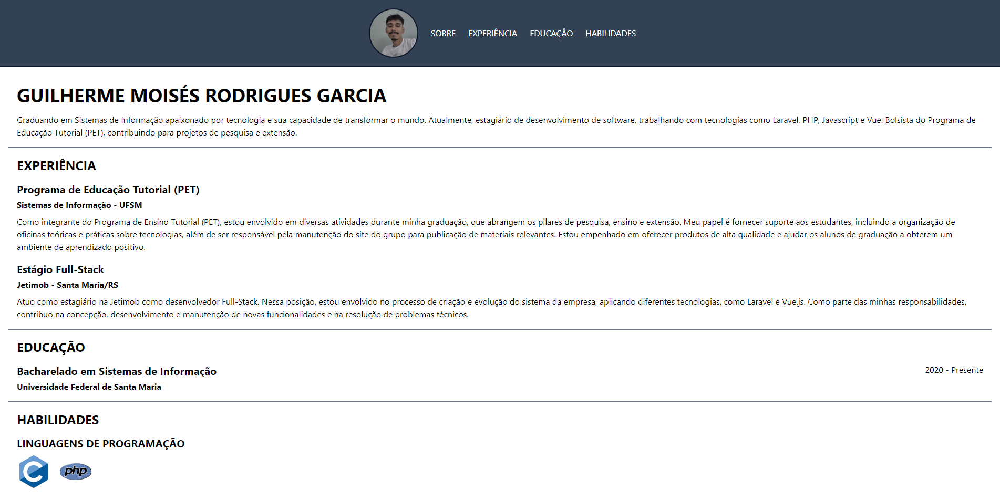

# Portfólio de Guilherme Moisés Rodrigues Garcia

.

Acesso: https://alexandre-chagasbrites.github.io/

#### Desenvolvedor(a)

Alexandre Chagas Brites

#### Cliente

Guilherme Moisés Rodrigues Garcia

#### Tecnologias

- HTML
- CSS
- Tailwind CSS

#### Ambiente de desenvolvimento

- VS Code

#### Créditos

- http://www-usr.inf.ufsm.br/~rtrindade/ (Template)
- https://devicon.dev/ (Ícones)

#### Bastidores

Usei o Tailwind CSS por sugestão do Guilherme. A parte mais trabalhosa foi a criação da barra de navegação. Como não conhecia o Tailwind CSS e não tinha experiência com CSS em si até achar o comando certo foi muita tentativa e erro.

---
Projeto entregue para a disciplina de [Desenvolvimento de Software para a Web](http://github.com/andreainfufsm/elc1090-2023a) em 2023a